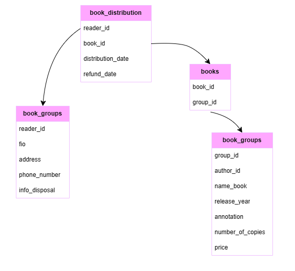

# Описание структуры базы данных университета

## Таблицы и их назначение

### 1. book_distribution (выдача книг)
- `reader_id` - идентификатор читателя(внешний ключ)
- `book_id` - идентификатор книги(внешний ключ)
- `distribution_date` - дата выдачи (ГГГГ-ММ-ДД)
- `refund_date` - дата возврата(ГГГГ-ММ-ДД)
Внутренний ключ: reader_id, book_id, distribution_date

### 2. books (Связь книги и группы)
- `reader_id` - идентификатор читателя (внутренний ключ)
- `book_id` - идентификатор книги (внешний ключ)

### 3. book_groups (Группы по авторам и названию)
Содержит данные о книгах.
- `group_id` - идентификатор группы (внутренний ключ)
- `author_id` - фамилия автора и инициалы
- `name_book` - название книги
- `release_book` - год издания
- `annotation` - аннотация
- `number_of_copies` - количество всевозможных экземпляров
- `price` - цена книги

### 4. book_groups (Группы по авторам и названию)
Содержит данные о читателях.
- `reader_id` - идентификатор читателя(внутренний ключ)
- `fio` - полные фамилия имя и отчество
- `adddress` - адрес читателя
- `phone_number` - телефонный номер
- `info_disposal` - информация о выбытии (True - не выбыл, False - выбыл)

## Связи между таблицами

